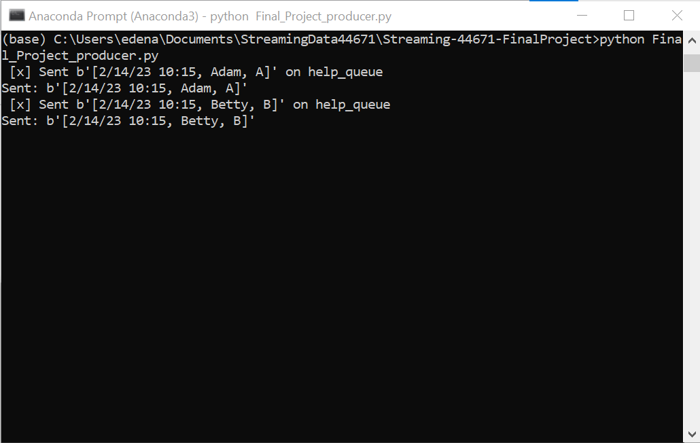
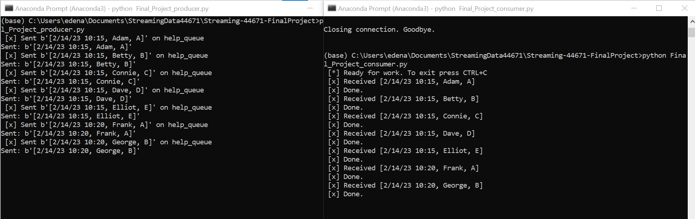
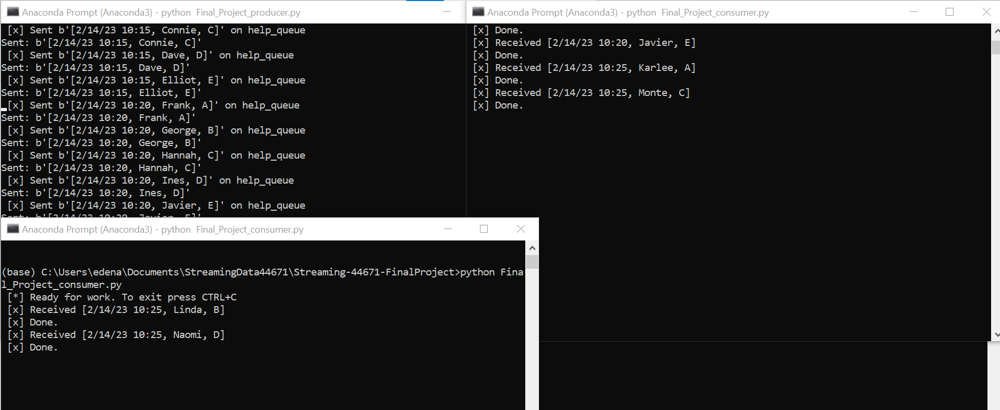
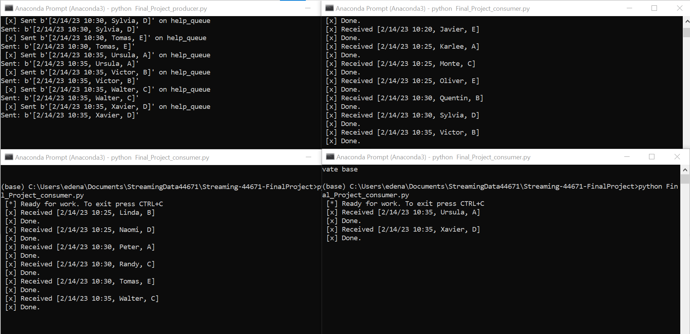
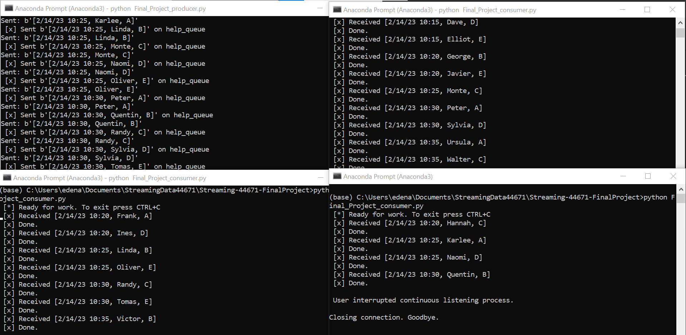
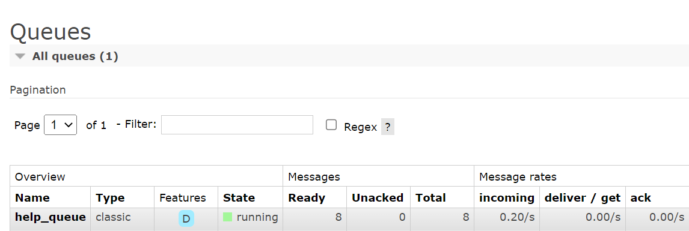

# Eden Anderson
## Streaming Data 44671 / Module 7 Final Project

# streaming-07-State-of-the-Art

> Build a unique custom streaming process based on what you've learned working with Python, pika, and RabbitMQ.

One producer will imitate multiple help desk tickets arriving into a queue. Multiple worker processes will receive the help requests and send acknowledgement responses. 

## Using a Help Desk System
When running a help desk, we monitor help requests sent by users to ensure that our user enjoys our product. There are always glitches in the system, as well as user error, so we want to make sure we respond to the following types of events:

1. The user needs help integrating the program with their hardware.
1. The user needs help with the program software.
1. The user is having trouble submitting payment to purchase the program.
1. The user needs help navigating the program online interface.
1. The user needs help with something outside the previous categories. 

## Help Desk System
We have a program that will time-stamp help requests and deliver them round-robin style to multiple workers. (The number of workers can change, as different staff may be online at different times.) These readings are an example of time-series data, and are considered streaming data or data in motion.

## Streaming Data
Our help desk system receives incoming messages based on when they are generated by program users. The help desk system allows the user to choose from five (5) different choices of the type of help they need:

1. I need help using this program on my computer (PC or Mac). (A)
1. I need help with the program itself. (B)
1. I need help purchasing the program. (C)
1. I need help using the online version of the program. (D)
1. I need help with something else. (E)

# We want to stream help desk tickets from consumers as they are submitted. 
Read values every 5 seconds. (sleep_secs = 5)

Help_Desk_Tickets.csv has 3 columns:

[0] Date_Time = Date-time stamp for the help ticket submission

[1] First_Name = First name of person who submitted a help request

[2] Help_Request = Letter corresponding to the message choice of customer

# Requirements
* RabbitMQ server running
* pika installed in your active environment

# Prerequisites
* RabbitMQ server
* Localhost established
* Installation of pika
* Working conda environment
* Access to Help_Desk.csv data file for help desk ticket data
* Access to Final_Project_producer.py to process simulated help desk tickets
* Access to Final_Project_consumer.py to process help desk tickets

## RabbitMQ Admin 

RabbitMQ comes with an admin panel. When you run the task emitter, reply y to open it. 

(Python makes it easy to open a web page - see the code to learn how.)

## Execute the Producer

1. Run Final_Project_producer.py (say y to monitor RabbitMQ queues)

Explore the RabbitMQ website.

## Execute a Consumer / Worker

1. Run Final_Project_consumer.py

Will it terminate on its own? How do you know? No - The message kept being received.  
When all the existing messages have been received, the listener seems to wait for a new message.  
(Plus, the first line reads to Ctrl-C to exit.)

## Start Another Listening Worker 

1. Use your Final_Project_consumer.py script to launch a second worker. 

## Reference

- [RabbitMQ Tutorial - Work Queues](https://www.rabbitmq.com/tutorials/tutorial-two-python.html)

## Screenshot

Here are screenshots of my running programs:

# Producer

The producer streams the data every five seconds (even though the time stamp is 5 minutes):

# Producer & 1 Worker

Having one worker means that worker gets all the help desk tickets:

# Producer & 2 Workers

Introducing a second worker creates an alternating distribution:

# Producer & 3 Workers

When we introduce a third worker, the round-robin distribution expands to a third screen:

# Producer & Back to 2 Workers

If one worker were to leave in the middle of streaming data, this is how the change might appear:

# RabbitMQ Displays Help Desk Queue

IF one worker were to leave in the middle of streaming data, this is how the change might appear:
